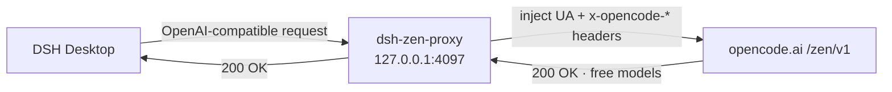

# dsh-zen-desktop

[](LICENSE)
[](https://www.microsoft.com/windows)
[](https://github.com/GlariaLuminous/dsh-zen-desktop/actions/workflows/ci.yml)
[](https://github.com/GlariaLuminous/dsh-zen-desktop/stargazers)

> 让 **DSH Desktop（Windows 桌面版）** 免 429 限流、一键使用 [OpenCode Zen](https://opencode.ai) 免费模型（deepseek-v4-flash-free 等 6 个免费档）的工具包。
>
> One-click toolkit to bypass OpenCode Zen 429 rate limits inside DSH Desktop (Windows) and unlock the 6 free models.

> 零修改应用文件：所有部署都落在用户目录（`DSH_HOME`），应用更新后无需重新安装；附自愈脚本，一次配好长期无忧。

## 背景：为什么默认会 429

OpenCode Zen 免费档（`FreeUsageLimitError` 429）按 HTTP 指纹识别请求来源：

| 请求特征 | 结果 |
| --- | --- |
| dsh 默认（UA 为 `deepseek-harness/...`，无 `x-opencode-*` 头） | 429 |
| 仅加 `x-opencode-*` 头，UA 不对 | 429 |
| UA 为 `opencode/...`，带 `x-opencode-*` 头 | 200 |
| 仅 UA 为 `opencode/...` | 200 |
| curl / 其他 UA | 429 |

且 dsh 会强制注入自己的 UA（配置里写的 `user-agent` 会被剥离），因此在 dsh 内直连 zen 网关必然 429。

**解决思路**：在 dsh 进程内架一个本地 OpenAI 兼容代理（`dsh-zen-proxy`，插件机制加载，无需改 dsh 文件），把 dsh 的请求原样转发给 `opencode.ai/zen/v1`，同时注入官方 opencode 客户端的 UA 与 `x-opencode-*` 头。dsh 只需把 `baseURL` 指到 `http://127.0.0.1:4097/v1` 即可。

另一个必要条件：API key 必须是 **opencode.ai 登录账号**创建的 key（匿名 key 也会被拒），在 [opencode.ai/account](https://opencode.ai/account) 创建。

## 架构



## 特性

- **一键安装**（`install.ps1`）：定位 DSH_HOME 与安装目录、部署插件、注册配置、配 key、自动重启并等待代理就绪，且**安装后自动冒烟测试**（向代理发一次请求验证可连通 Zen，可用 `-NoTest` 跳过）；全程幂等可重复执行；
- **零改动应用文件**：插件 + junction 都在 `%APPDATA%\dsh-desktop\harness` 下，DSH Desktop 更新不破坏部署；
- **自愈**（`repair.ps1`）：一键检查/修复所有部署项；可注册"登录时自动修复"计划任务；
- **多 key 轮换**（`add-key.ps1`）：多个 opencode.ai 账号交替使用，叠加免费额度；
- **卸载**（`uninstall.ps1`）：完整回滚，恢复直连原始配置；
- 顺带修复 `storages\*.json` 的 UTF-8 BOM 问题（否则 harness 启动报 `file is not valid JSON`）；
- **跨端口一致**：`install.ps1` 与 `repair.ps1` 共用 `-Port` 参数（默认 4097），改端口时自愈不会写回错误的硬编码端口。

## 快速开始

前置：已安装 DSH Desktop 桌面版；有 opencode.ai 账号的 API key（账号 key，非匿名）。

```powershell
# 1. 克隆本仓库
git clone https://github.com/GlariaLuminous/dsh-zen-desktop.git
cd dsh-zen-desktop

# 2. 安装（会提示粘贴 key，或直接传参）
.\install.ps1 -Key sk-xxxx
#    默认端口 4097；不想自动重启加 -NoRestart；不想自动冒烟测试加 -NoTest

# 3. 在 DSH Desktop 中选择模型 opencode / deepseek-v4-flash-free 开始对话
```

> English: clone the repo, run `.\install.ps1 -Key <your-opencode-account-key>`, then pick `opencode / deepseek-v4-flash-free` in DSH Desktop. The key must be created from a logged-in opencode.ai account (anonymous keys are rejected).

## 验证

```powershell
# 代理是否在监听
Get-NetTCPConnection -LocalPort 4097 -State Listen

# 冒烟测试（直接打本地代理）
$key = (Get-Content "$env:APPDATA\dsh-desktop\harness\.credentials.yaml" | Select-String 'OPENCODE_API_KEY').Line -split ':\s*',2 | Select-Object -Last 1
$body = '{"model":"deepseek-v4-flash-free","messages":[{"role":"user","content":"hi"}],"max_tokens":16}'
Invoke-WebRequest -Uri "http://127.0.0.1:4097/v1/chat/completions" -Method POST `
  -Headers @{ Authorization = "Bearer $key" } -Body $body -UseBasicParsing
```

返回 HTTP 200 即部署成功；429 请检查 key 是否为账号 key。

## 多 key 轮换

```powershell
.\add-key.ps1 -Key sk-另一个账号的key -Slot 2   # 可到 Slot 9
```

重启后在模型选择器中选 `opencode-2` 下的模型即用第二个账号。设置里会写入 `OPENCODE_API_KEY_2` 与 `opencode-2` provider。

## 应用更新后 / 自愈

代理插件与配置全在用户目录，应用更新**不破坏部署**；唯一需要重新校准的是 `@deepseek-ai` junction 的目标（应用安装目录变化时）。

```powershell
# 手动自愈
.\repair.ps1

# 注册登录时自动自愈（推荐）
.\repair.ps1 -CreateScheduledTask
# 移除：.\repair.ps1 -RemoveScheduledTask
```

## 卸载

```powershell
.\uninstall.ps1            # 移除插件与配置，恢复直连；保留 key
.\uninstall.ps1 -RemoveKey # 连 key 一起删
```

## 工作原理（部署清单）

| 部署项 | 位置 |
| --- | --- |
| 代理插件（复制） | `%APPDATA%\dsh-desktop\harness\profiles\web\plugins\dsh-zen-proxy\` |
| 依赖 junction | `...\plugins\dsh-zen-proxy\node_modules\@deepseek-ai` → DSH Desktop 安装目录内依赖树（只读引用，不复制） |
| 插件注册 | `...\profiles\web\cordis.patch.yml`（`insert: zen-proxy`） |
| provider 配置 | `...\settings.yaml`：`llm-pi-ai.providers.opencode.baseURL = http://127.0.0.1:4097/v1` |
| API key | `...\.credentials.yaml`：`OPENCODE_API_KEY` |
| 自愈计划任务（可选） | `dsh-zen-desktop-repair`（登录时运行） |

## 常见问题

**还是 429？** 确认 key 是账号 key（匿名 key 无效）；确认代理在监听（4097）；打开 `%APPDATA%\dsh-desktop\logs\harness.log` 看插件是否报错。

**端口冲突？** 修改 `cordis.patch.yml` 中 `port` 与 `settings.yaml` 中 `baseURL` 端口保持一致即可（4097 → 其他）；`install.ps1 -Port` 与 `repair.ps1 -Port` 需使用同一端口。

**harness 启动报 "file is not valid JSON"？** 运行 `.\repair.ps1`（会清除 storages 中 JSON 的 BOM），或手动用无 BOM 的 UTF-8 保存 `storages\workspace.json`。

**限制**：免费档按账号限流，额度用尽换 key（见多 key 轮换）。本工具仅面向 **DSH Desktop 桌面版**；npm/CLI 版 dsh 可参考 [Yee-h/dsh-zen-proxy](https://github.com/Yee-h/dsh-zen-proxy)。

## 测试

逻辑层有 Pester 回归测试（覆盖历史 YAML 块边界 bug），由 GitHub Actions 自动运行：

```powershell
# 本地运行
Install-Module Pester -Force -Scope CurrentUser
Invoke-Pester tests/dsh-zen-desktop.Tests.ps1
```

## 致谢与许可

- 代理插件 vendored 自 [Yee-h/dsh-zen-proxy](https://github.com/Yee-h/dsh-zen-proxy)（MIT，见 `plugins/dsh-zen-proxy/LICENSE`）；
- 本项目 MIT 许可，见 [LICENSE](LICENSE)；
- 与 DeepSeek / DSH 官方无关，仅供学习研究，请遵守 OpenCode Zen 服务条款。
